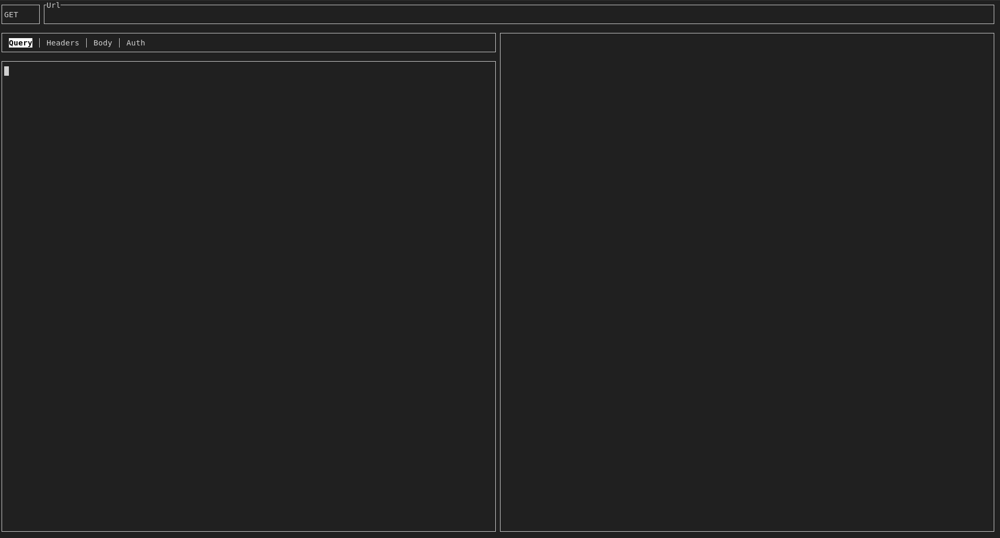

# Restui

Restui is a small, interactive TUI application for inspecting HTTP requests. It's layout is similar to that of Postman's. The application is entirely navigatable using only the keyboard, however mouse events are also supported.  

**NOTE**: This is still an unfinished application and there may be bugs.

## Keybinds 

| Keybind | Description|
|---|---|
|`CTRL + n`| Move to next input|
|`CTRL + p`| Move to previous input|
|`CTRL + r`| Send request|

Once the tab input is selected, arrow keys are used to navigating between different tabs.  
Pressing `Enter` on the tab will jump directly to the body text input.   
Pressing `Enter` on the request type will bring up a menu to change it.  
Mouse navigation is also supported, just click on the input you want to select.

## Screenshot
